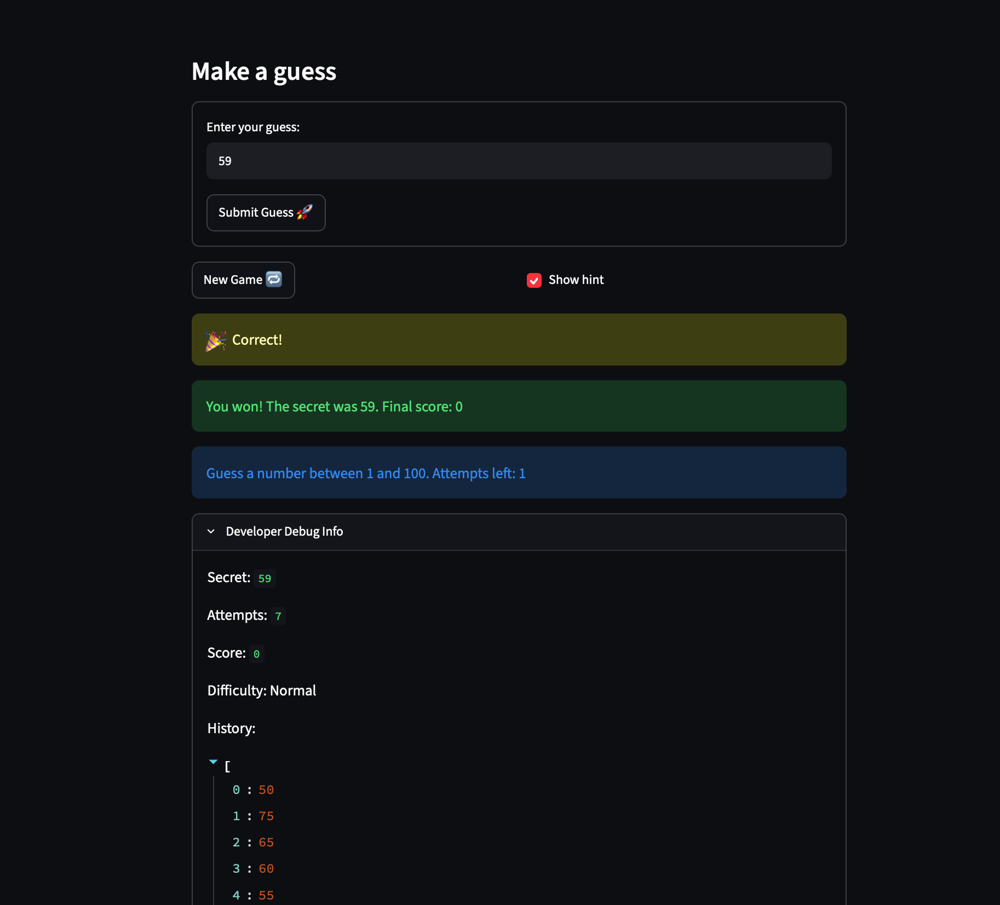

# 🎮 Game Glitch Investigator: The Impossible Guesser

## 🚨 The Situation

You asked an AI to build a simple "Number Guessing Game" using Streamlit.
It wrote the code, ran away, and now the game is unplayable. 

- You can't win.
- The hints lie to you.
- The secret number seems to have commitment issues.

## 🛠️ Setup

1. Install dependencies: `pip install -r requirements.txt`
2. Run the broken app: `python -m streamlit run app.py`

## 🕵️‍♂️ Your Mission

1. **Play the game.** Open the "Developer Debug Info" tab in the app to see the secret number. Try to win.
2. **Find the State Bug.** Why does the secret number change every time you click "Submit"? Ask ChatGPT: *"How do I keep a variable from resetting in Streamlit when I click a button?"*
3. **Fix the Logic.** The hints ("Higher/Lower") are wrong. Fix them.
4. **Refactor & Test.** - Move the logic into `logic_utils.py`.
   - Run `pytest` in your terminal.
   - Keep fixing until all tests pass!

## 📝 Document Your Experience

- Game purpose: A number guessing game built with Streamlit. The player picks a difficulty, then guesses a secret number within a limited number of attempts and gets Higher/Lower hints and a score.
- Bugs i found: hint messages were reversed, the secret was converted to a string on even attemps, the info box always said between 1 and 100 no matter the difficulty, new game didn't reset the status, score or history and ignored the difficulty range, submit needed two clicks, scoring was also wrong. 
- Fixes I applied: 
  - Moved the game rules into logic_utils.py and swapped the hint messages.
  - Removed the string conversion so check_guess always compares real numbers.
  - Made the info box use the difficulty's low and high.
  - Reset attempts, score, status, history, and the secret in New Game.
  - Wrapped the input and button in st.form so one click submits.
  - Simplified update_score: a win gives `100 - 10 * attempt_number` (minimum 10), and every wrong guess subtracts 5.
  - Moved the status display into render_status(), called after the guess is processed.

I used Claude for explanations and Claude Code for edits and tests. I reviewed every diff and verified each fix by playing the game and running pytest.

## 📸 Demo Walkthrough

Sample game on Normal difficulty (range 1 to 100, 8 attempts), secret number 59:

1. The player enters 50 and clicks **Submit Guess**. The game shows "📈 Go HIGHER!" and the score drops to -5.
2. The player enters 75. The game shows "📉 Go LOWER!" and the score drops to -10.
3. The player enters 65. The game shows "📉 Go LOWER!" and the score drops to -15.
4. The player enters 60. The game shows "📉 Go LOWER!" and the score drops to -20.
5. The player enters 55. The game shows "📈 Go HIGHER!" and the score drops to -25.
6. The player enters 57. The game shows "📈 Go HIGHER!" and the score drops to -30.
7. The player enters 59. The game shows "🎉 Correct!" and balloons appear.
8. The win on attempt 7 scores 100 - 10 × 7 = 30 points, so the final score is -30 + 30 = 0.
9. Developer Debug Info shows attempts 7, score 0, and a history of 50, 75, 65, 60, 55, 57, 59. "Attempts left" shows 1 (8 allowed, 7 used).

**Screenshot** *(optional)*:



## 🧪 Test Results

```
tests/test_game_logic.py::test_winning_guess PASSED           [ 10%]
tests/test_game_logic.py::test_guess_too_high PASSED          [ 20%]
tests/test_game_logic.py::test_guess_too_low PASSED           [ 30%]
tests/test_game_logic.py::test_win_on_first_attempt_scores_90 PASSED [ 40%]
tests/test_game_logic.py::test_too_high_on_even_attempt_subtracts_5 PASSED [ 50%]
tests/test_game_logic.py::test_too_low_subtracts_5 PASSED     [ 60%]
tests/test_game_logic.py::test_late_win_scores_at_least_10 PASSED [ 70%]
tests/test_game_logic.py::test_info_box_shows_difficulty_range[Easy-1-20] PASSED [ 80%]
tests/test_game_logic.py::test_info_box_shows_difficulty_range[Normal-1-100] PASSED [ 90%]
tests/test_game_logic.py::test_info_box_shows_difficulty_range[Hard-1-50] PASSED [100%]
```
======10 passed in 1.49s=====


## 🚀 Stretch Features

